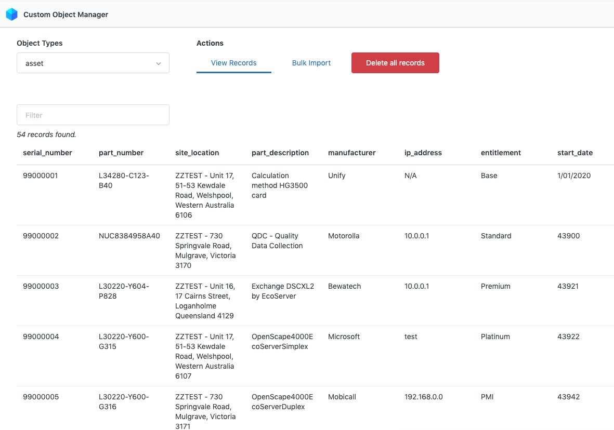
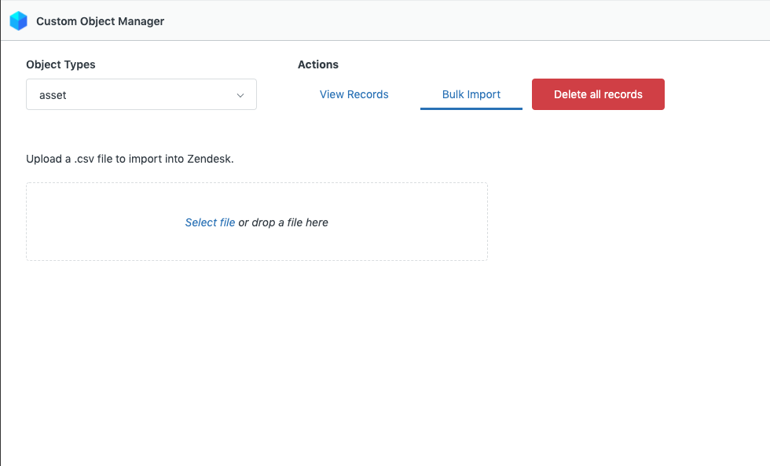
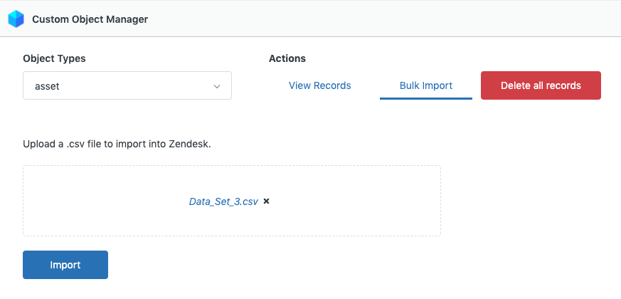
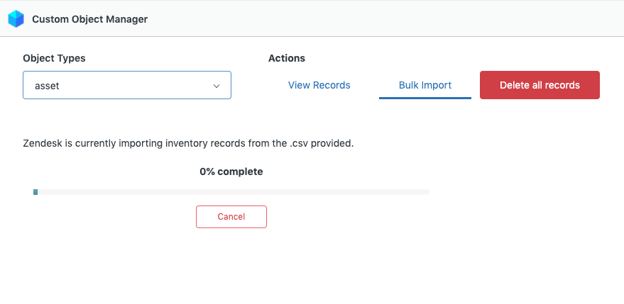
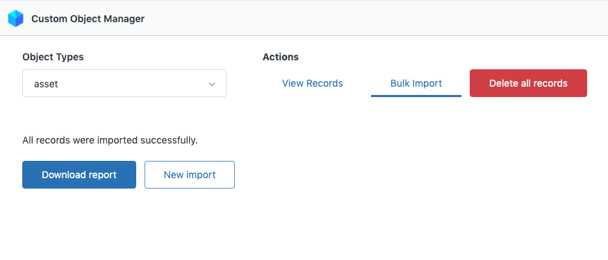

# Custom Object Manager

This navbar app allows zendesk support admins to easily manage custom object records from support interface.

## Features

### Version 1.0

* Retrieves all object types of the instance and displays them on a dropdown.
* Displays all the records of the selected object type in a tabular form.
* Bulk import from a .csv file and export import data report.
* Bulk delete all of the records of the selected object type.

Note: For Bulk Import. CSV Column Headers should match the attribute key of the object type

## Screenshots

Icons made by <a href="https://www.flaticon.com/authors/freepik" title="Freepik">Freepik</a> from <a href="https://www.flaticon.com/" title="Flaticon">www.flaticon.com</a>

